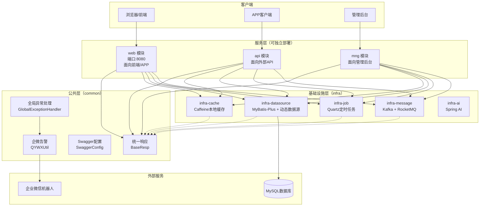
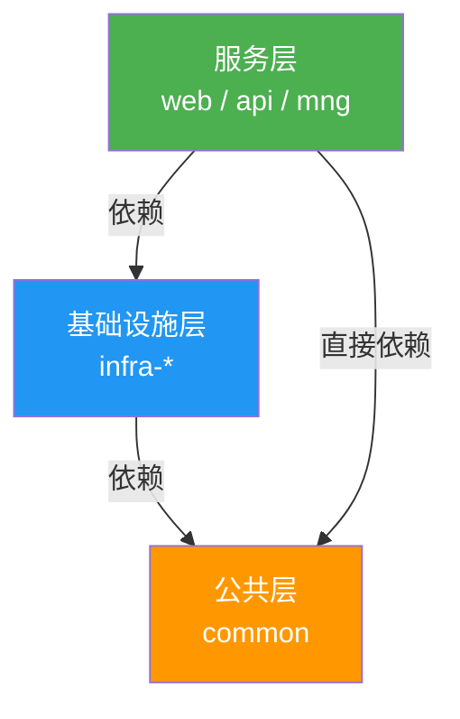
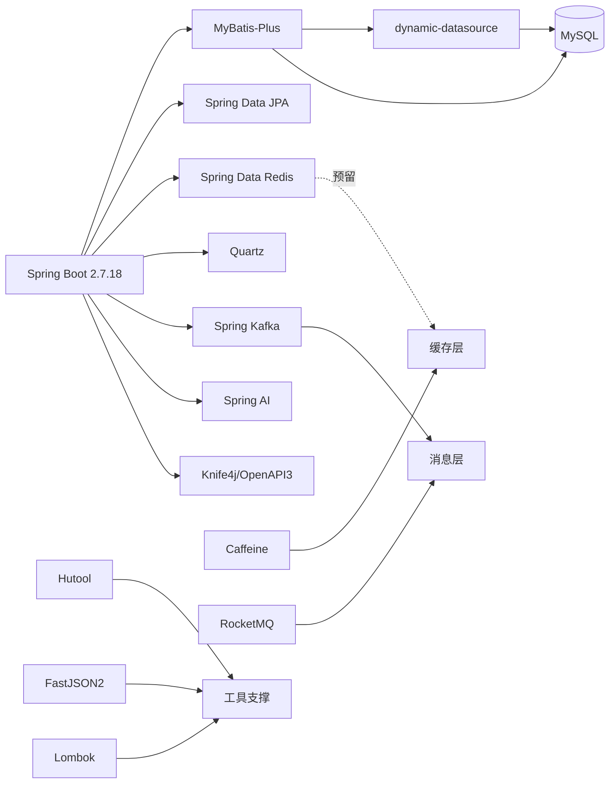
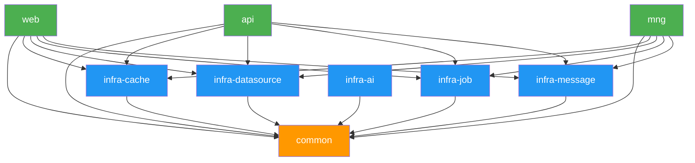

# 系统架构

## 1. 系统概述

**multi-module-project** 是一个基于 Spring Boot 2.7.18 的多模块企业级 Java 应用脚手架项目。该项目采用分层多模块架构，提供了统一的基础设施能力（缓存、数据源、定时任务、消息队列、AI 集成），并支持按业务场景拆分为多个独立可部署的服务模块（web、api、mng）。

**项目核心能力：**
- 统一的 API 响应封装与全局异常处理
- Swagger/Knife4j 接口文档自动生成
- Caffeine 本地缓存（支持自定义过期时间）
- MyBatis-Plus + 动态多数据源
- Quartz 定时任务调度
- Kafka + RocketMQ 消息队列集成
- Spring AI 人工智能能力集成
- 企业微信机器人告警通知

## 2. 系统架构设计

### 系统架构图

### 系统边界与上下游

| 方向 | 系统/服务 | 交互方式 | 说明 |
|------|-----------|----------|------|
| 上游 | 浏览器/APP客户端 | HTTP REST API | 通过 web 模块提供服务 |
| 上游 | 外部系统 | HTTP REST API | 通过 api 模块提供对外接口 |
| 上游 | 管理后台 | HTTP REST API | 通过 mng 模块提供管理接口 |
| 下游 | MySQL 数据库 | JDBC (HikariCP) | 主从数据源配置 |
| 下游 | 企业微信机器人 | HTTP POST (Webhook) | 异常告警通知 |
| 下游 | Kafka/RocketMQ | 消息协议 | 异步消息处理（预留） |

## 3. 架构风格与形态

- **架构风格：** 分层架构 + 多模块单体
- **部署形态：** 每个服务模块（web/api/mng）可独立打包为 Spring Boot Fat JAR 独立部署
- **模块化策略：** 水平分层（common → infra → service）+ 垂直按业务拆分（web/api/mng）
- **扩展方式：** 新增业务模块只需创建新 module 并依赖 common + infra 子模块

## 4. 分层设计

| 层次 | 模块 | 职责 |
|------|------|------|
| **服务层** | web, api, mng | 业务逻辑、Controller、启动入口 |
| **基础设施层** | infra-cache, infra-datasource, infra-job, infra-message, infra-ai | 技术组件封装，提供缓存/数据源/任务/消息/AI能力 |
| **公共层** | common | DTO、统一响应、全局异常处理、工具类、Swagger配置 |

## 5. 技术栈

| 领域 | 技术 | 版本 | 用途 |
|------|------|------|------|
| **核心框架** | Spring Boot | 2.7.18 | 应用框架 |
| **语言** | Java | 11 | 开发语言 |
| **ORM** | MyBatis-Plus | 3.5.3.1 | 数据库操作 |
| **JPA** | Spring Data JPA | 2.7.x | 数据访问抽象 |
| **数据源** | dynamic-datasource | 3.5.0 | 动态多数据源 |
| **数据库** | MySQL | - | 关系型数据库 |
| **连接池** | HikariCP | 内置 | 数据库连接池 |
| **本地缓存** | Caffeine | 3.1.8 | 高性能本地缓存 |
| **分布式缓存** | Redis (Spring Data Redis) | 2.7.18 | 分布式缓存（预留） |
| **定时任务** | Quartz | 内置 | 任务调度 |
| **消息队列** | Kafka + RocketMQ | 2.2.2 (RMQ) | 异步消息 |
| **AI** | Spring AI | 1.0.3 | AI 能力集成 |
| **接口文档** | Knife4j (OpenAPI 3) | 4.4.0 | Swagger 接口文档 |
| **工具库** | Hutool | 5.8.23 | Java 工具类集合 |
| **JSON** | FastJSON2 | 2.0.33 | JSON 序列化 |
| **代码简化** | Lombok | 1.18.30 | 减少样板代码 |

### 技术栈关联关系

## 6. 模块依赖关系

### 依赖说明

| 模块 | 直接依赖 | 性质 |
|------|----------|------|
| **web** | common, infra-cache, infra-datasource, infra-job, infra-message | 可运行服务 |
| **api** | common, infra-cache, infra-datasource, infra-job, infra-message | 可运行服务 |
| **mng** | common, infra-cache, infra-datasource, infra-job, infra-message | 可运行服务 |
| **infra-cache** | common (通过 infra 父 POM 继承) | 基础设施库 |
| **infra-datasource** | common (通过 infra 父 POM 继承) | 基础设施库 |
| **infra-job** | common (通过 infra 父 POM 继承) | 基础设施库 |
| **infra-message** | common (通过 infra 父 POM 继承) | 基础设施库 |
| **infra-ai** | common (通过 infra 父 POM 继承) | 基础设施库 |
| **common** | 无内部依赖 | 公共基础库 |
