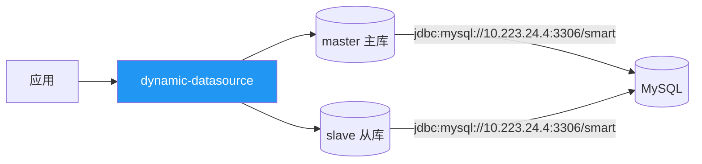
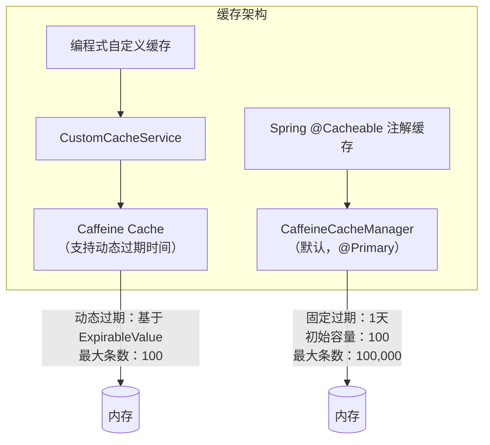
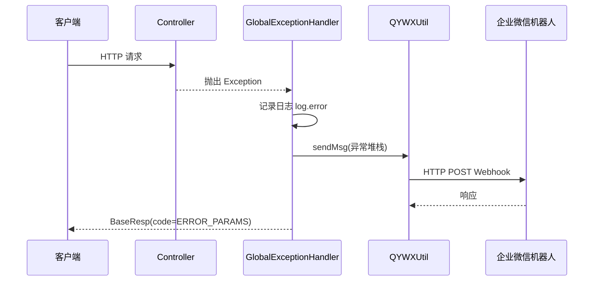

# 基础设施

## 1. 服务注册与配置中心

### 当前状态

项目中 **Nacos 配置中心已注释**，未启用。相关配置位于 `web/src/main/resources/application-test.yml`：

```yaml
# nacos配置中心相关配置（已注释）
# spring.cloud.nacos.config.server-addr=10.223.24.2:8848
# spring.cloud.nacos.config.namespace=yyyf_test
# spring.cloud.nacos.config.file-extension=yaml
# spring.cloud.nacos.config.group=DEFAULT_GROUP
# spring.cloud.nacos.username=yyyf_test
# spring.cloud.nacos.password=yyyf_test@123qwer
```

### 说明

- 注册中心：未启用（无 Spring Cloud 依赖）
- 配置中心：预留 Nacos 接入能力，当前使用本地 YAML 配置
- 配置方式：`application.yml`（主配置） + `application-{profile}.yml`（环境配置），通过 `spring.profiles.active` 切换

## 2. 数据层基础设施

### 2.1 数据库服务

**模块：** `infra-datasource`

**技术方案：**

| 组件 | 技术 | 版本 | 说明 |
|------|------|------|------|
| ORM 框架 | MyBatis-Plus | 3.5.3.1 | 增强型 MyBatis |
| JPA | Spring Data JPA | 2.7.x | 数据访问抽象层 |
| 动态数据源 | dynamic-datasource | 3.5.0 | 支持主从/多数据源切换 |
| 数据库驱动 | mysql-connector-j | 内置 | MySQL JDBC 驱动 |
| 连接池 | HikariCP | 内置 | 高性能连接池 |

**数据源配置（test 环境）：**



| 配置项 | master | slave |
|--------|--------|-------|
| JDBC URL | `jdbc:mysql://10.223.24.4:3306/smart` | `jdbc:mysql://10.223.24.4:3306/smart` |
| 连接池类型 | HikariCP | HikariCP |
| 最小空闲连接 | 20 | 20 |
| 最大连接数 | 50 | 50 |
| 空闲超时 | 30,000ms | 30,000ms |
| 最大生命周期 | 1,800,000ms (30min) | 1,800,000ms (30min) |
| 连接超时 | 30,000ms | 30,000ms |
| 健康检测 | `select 1` | `select 1` |

**MyBatis-Plus 配置：**

| 配置项 | 值 | 说明 |
|--------|-------|------|
| Mapper 扫描路径 | `classpath:/mapping/*.xml` | XML Mapper 文件位置 |
| 别名包 | `com.eking.model.entity` | 实体类包路径 |

> **注意：** 全局逻辑删除配置（`global-config.db-config.logic-delete-field` 等）已移除，如需逻辑删除请在实体类上使用 `@TableLogic` 注解按需配置。

### 2.2 对象存储服务

当前项目 **未集成对象存储服务**。

文件上传配置已预留：
- `spring.servlet.multipart.max-file-size: 100MB`
- `spring.servlet.multipart.max-request-size: 100MB`

## 3. 缓存服务

**模块：** `infra-cache`

### 本地缓存 - Caffeine

项目提供两级缓存机制：



| 缓存类型 | Bean 名称 | 过期策略 | 最大容量 | 使用方式 |
|----------|-----------|----------|----------|----------|
| 注解缓存 | `caffeineCacheManager` | 写入后1天固定过期 | 100,000 | `@Cacheable` 注解 |
| 自定义缓存 | `customCache` | 基于 `ExpirableValue` 动态过期 | 100 | `CustomCacheService` API |

**CustomCacheService API：**

| 方法 | 说明 |
|------|------|
| `put(key, value)` | 存入缓存（默认过期时间） |
| `put(key, value, TimeUnit, expireTime)` | 存入缓存（自定义过期时间） |
| `get(key)` | 获取缓存值（自动解包 ExpirableValue） |
| `remove(key)` | 删除单个缓存 |
| `remove(List<String>)` | 批量删除缓存 |
| `clear()` | 清空所有缓存 |

### 分布式缓存 - Redis

`infra-cache` 模块已引入 `spring-boot-starter-data-redis` 依赖，但 **当前未配置 Redis 连接信息**，属于预留能力。

## 4. 消息队列

**模块：** `infra-message`

| 消息中间件 | 依赖 | 版本 | 状态 |
|-----------|------|------|------|
| **Kafka** | `spring-kafka` | Spring Boot 内置 | 已引入依赖，未实现业务代码 |
| **RocketMQ** | `rocketmq-spring-boot-starter` | 2.2.2 | 已引入依赖，未实现业务代码 |

当前消息队列模块为 **框架预留**，尚未编写生产者/消费者代码。

## 5. 任务调度

**模块：** `infra-job`

| 配置项 | 值 | 说明 |
|--------|-------|------|
| 调度框架 | Quartz | Spring Boot 内置 Quartz Starter |
| 状态 | 已引入依赖 | 未实现具体 Job 类 |

当前任务调度模块为 **框架预留**，尚未编写定时任务代码。

## 6. 日志、监控、链路追踪

### 日志

| 配置项 | 值 | 说明 |
|--------|-------|------|
| 日志框架 | SLF4J + Logback | Spring Boot 默认 |
| 根日志级别 | `info` | 配置在 application.yml |
| 日志使用方式 | `@Slf4j` (Lombok) | 全局异常处理器等核心类使用 |

### 异常告警

项目集成了 **企业微信机器人** 作为异常告警通道：



| 配置项 | 说明 |
|--------|------|
| Webhook URL | `https://qyapi.weixin.qq.com/cgi-bin/webhook/send` |
| 配置 Key | `framework.alert.weixin.key` （通过 `@Value` 注入） |
| 消息类型 | text |
| 消息长度限制 | 截断至 1800 字符 |
| @提醒范围 | `@all` |
| 触发条件 | `GlobalExceptionHandler` 捕获 `Exception`（非 `CustomException`、非参数校验异常） |

### 监控与链路追踪

当前项目 **未集成** 监控和链路追踪组件（如 Prometheus、Grafana、SkyWalking 等）。

## 7. 环境配置

### 配置文件结构

```
web/src/main/resources/
├── application.yml           # 主配置（通用）
└── application-test.yml      # test 环境配置（数据源等）
```

### 环境切换

通过 `spring.profiles.active` 控制，当前默认激活 `test` 环境：

```yaml
spring:
  profiles:
    active: test
```

### 关键配置汇总

| 配置项 | 值 | 文件 |
|--------|-------|------|
| 服务端口 | 8080 | application.yml |
| 应用名称 | web | application.yml |
| 日期格式 | `yyyy-MM-dd HH:mm:ss` | application.yml |
| 时区 | `GMT+8` | application.yml |
| 路径匹配策略 | `ant_path_matcher` | application.yml |
| Bean 定义覆盖 | `true` | application.yml |
| 文件上传限制 | 100MB | application.yml |
| 日志级别 | info | application.yml |
| 数据源类型 | 动态数据源（master/slave） | application-test.yml |
