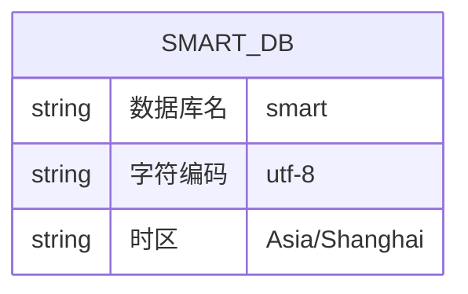

# 数据库设计

## 1. ER 图概览

> **说明：** 当前项目处于脚手架阶段，代码中尚未定义实体类（Entity）和 Mapper 接口。MyBatis-Plus 配置中指定了实体类包路径 `com.eking.model.entity`，但该包尚未创建。以下为根据配置推断的数据库设计规范。

当前连接的数据库为 `smart`，位于 `10.223.24.4:3306`。

## 2. 核心表结构设计

### 2.1 数据库连接信息

| 配置项 | 值 |
|--------|-------|
| 数据库地址 | `10.223.24.4:3306` |
| 数据库名 | `smart` |
| 驱动 | `com.mysql.cj.jdbc.Driver` |
| 字符编码 | `utf-8` |
| 时区 | `Asia/Shanghai` |
| 连接池 | HikariCP |
| 数据源模式 | 动态数据源（master/slave） |

### 2.2 表设计规范（从配置推断）

根据 `application.yml` 中的 MyBatis-Plus 配置，项目遵循以下数据库设计规范：

| 规范项 | 配置值 | 说明 |
|--------|--------|------|
| 实体类包 | `com.eking.model.entity` | 实体类统一存放路径 |
| Mapper XML | `classpath:/mapping/*.xml` | XML Mapper 文件位置 |

> **注意：** 全局逻辑删除配置已移除（参见提交 `2c15c60`）。如需逻辑删除，请在实体类字段上使用 `@TableLogic` 注解按需配置。

### 2.3 待建设内容

由于项目当前处于基础框架搭建阶段，以下内容待后续业务开发时补充：

- [ ] 实体类定义（Entity）
- [ ] Mapper 接口定义
- [ ] Mapper XML 文件
- [ ] 具体表结构 DDL
- [ ] 完整 ER 图
