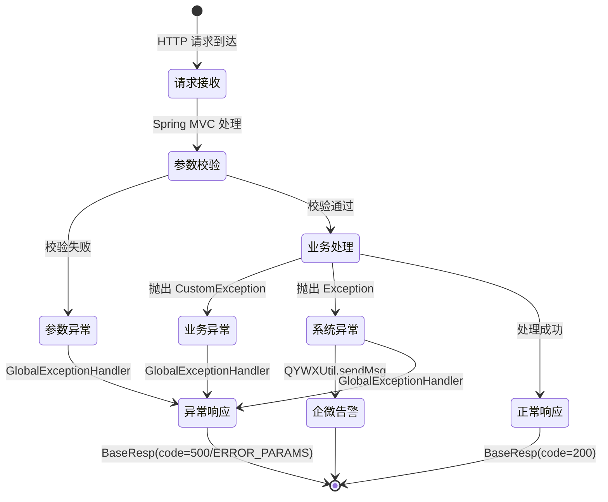
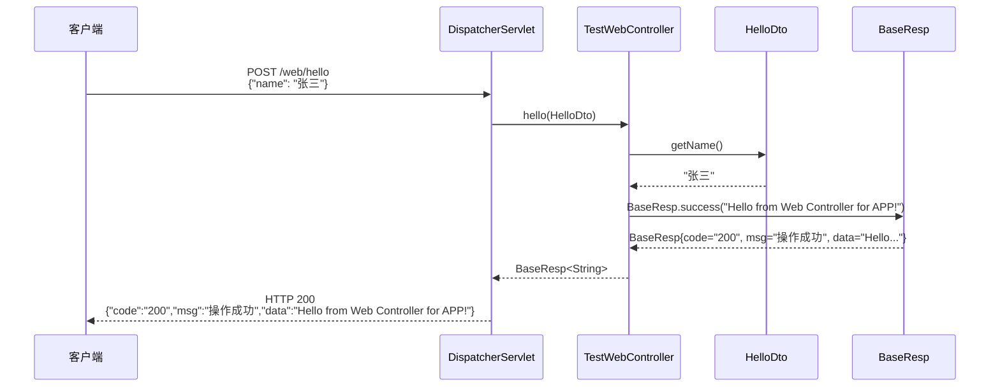
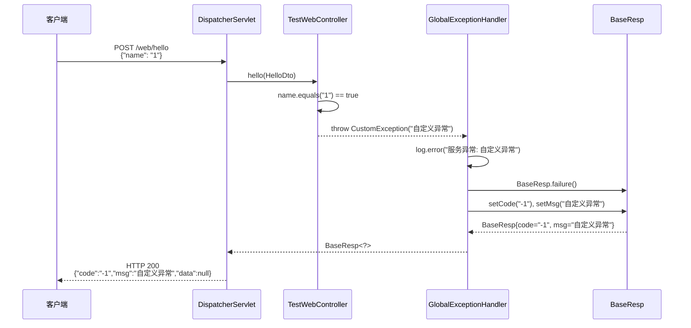
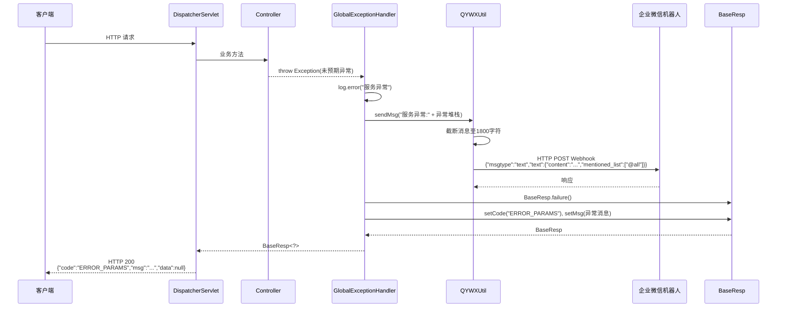
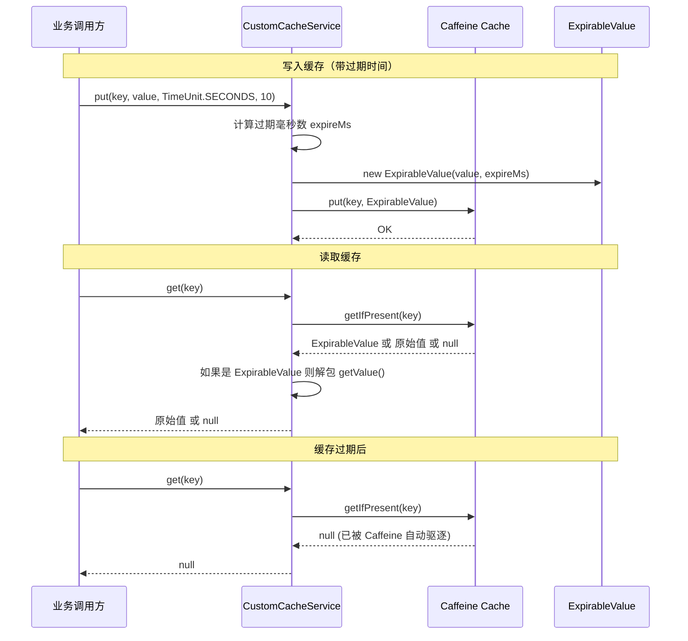
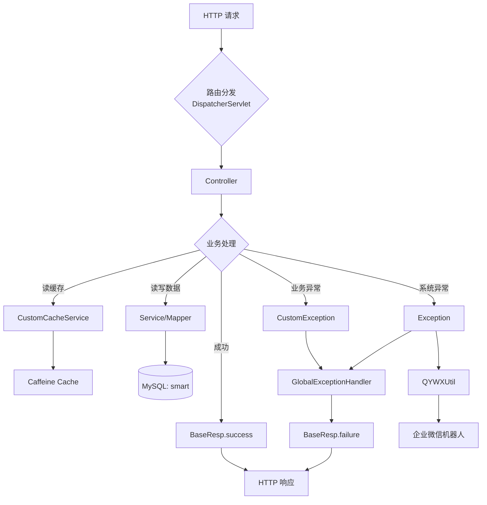

# 数据流转链路

## 1. 业务状态流转

### 1.1 HTTP 请求处理流转

当前项目已实现的核心数据流转链路为 **HTTP 请求的完整处理流程**，包括正常响应和异常处理两条路径。

## 2. 核心链路时序图

### 2.1 正常请求处理链路

### 2.2 业务异常处理链路

### 2.3 系统异常处理链路（含企微告警）

### 2.4 缓存数据流转链路

## 3. 数据流图总览

