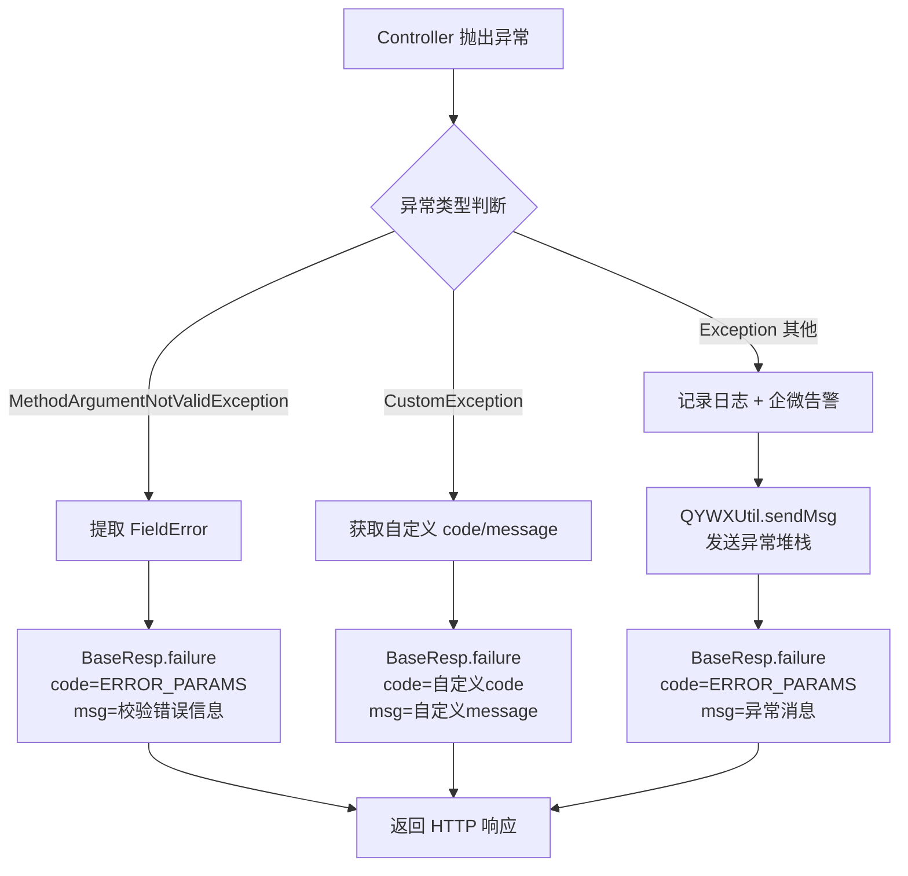

# 功能模块梳理 - Common 公共模块

## 1. 模块功能描述

`common` 模块是整个项目的公共基础层，提供所有服务模块共享的基础能力，包括：

- **统一响应封装**：`BaseResp<T>` 泛型响应体，标准化所有 API 接口的返回格式
- **全局异常处理**：`GlobalExceptionHandler` 统一拦截并处理所有异常
- **自定义异常体系**：`CustomException` + `CommonError` 错误码枚举
- **Swagger 接口文档配置**：基于 Knife4j/OpenAPI3 的统一文档配置
- **企微告警工具**：通过企业微信机器人 Webhook 发送异常告警
- **公共 DTO**：跨模块共享的数据传输对象

## 2. 关键业务规则与约束

| 规则 | 说明 |
|------|------|
| 响应格式统一 | 所有接口必须返回 `BaseResp<T>` 格式：`{code, msg, data}` |
| 成功码 | `"200"`，默认消息 `"操作成功"` |
| 失败码 | `"500"` 或自定义错误码 |
| 异常分级处理 | 参数校验异常 → 返回错误信息；业务异常 → 返回自定义错误码和消息；系统异常 → 返回错误 + 发送企微告警 |
| 企微消息长度 | 内容截断至 1800 字符 |
| 组件扫描 | 所有服务模块需配置 `scanBasePackages = "com.eking"` 以扫描 common 中的组件 |

## 3. 核心类和方法说明

### 3.1 BaseResp\<T\> - 统一响应体

**文件：** `common/src/main/java/com/eking/common/mvc/BaseResp.java`

| 字段 | 类型 | 说明 |
|------|------|------|
| `data` | `T` | 响应数据 |
| `code` | `String` | 状态码（"200"=成功，"500"=失败） |
| `msg` | `String` | 响应消息 |

| 方法 | 返回类型 | 说明 |
|------|----------|------|
| `success()` | `BaseResp<T>` | 成功响应（无数据） |
| `success(T data)` | `BaseResp<T>` | 成功响应（带数据） |
| `failure()` | `BaseResp<?>` | 失败响应（无消息） |
| `failure(String msg)` | `BaseResp<?>` | 失败响应（带错误消息） |
| `builder()` | `ResultBuilder<T>` | 获取构建器实例 |

**内部类 ResultBuilder\<T\>：** 提供链式构建能力 `builder().success().data(xxx).msg(xxx).build()`

### 3.2 GlobalExceptionHandler - 全局异常处理器

**文件：** `common/src/main/java/com/eking/common/exception/GlobalExceptionHandler.java`

| 方法 | 处理异常 | 行为 |
|------|----------|------|
| `handlerMethodArgumentNotValidException` | `MethodArgumentNotValidException` | 提取校验字段错误信息，code=ERROR_PARAMS |
| `handler` | `CustomException` | 使用自定义 code 和 message |
| `handlerException` | `Exception`（兜底） | code=ERROR_PARAMS + 发送企微告警 |

### 3.3 CustomException - 自定义业务异常

**文件：** `common/src/main/java/com/eking/common/exception/CustomException.java`

| 构造方法 | 说明 |
|----------|------|
| `CustomException(String code, String message)` | 指定错误码和消息 |
| `CustomException(String message)` | 仅消息，code 默认 "-1" |
| `CustomException(String message, Throwable cause)` | 带原因链，code 默认 "-1" |

### 3.4 CommonError - 公共错误码枚举

**文件：** `common/src/main/java/com/eking/common/exception/CommonError.java`

| 枚举值 | code | desc |
|--------|------|------|
| `NULL_PARAMS` | `"NULL_PARAMS"` | 参数为空 |
| `ERROR_PARAMS` | `"ERROR_PARAMS"` | 参数错误 |
| `NOT_EXIST_ERROR` | `"NOT_EXIST_ERROR"` | 不存在的错误 |
| `UNKNOWN_ERROR` | `"UNKNOWN_ERROR"` | 未知错误 |

### 3.5 SwaggerConfig - Swagger 配置

**文件：** `common/src/main/java/com/eking/common/config/SwaggerConfig.java`

| 配置属性 | 来源 | 说明 |
|----------|------|------|
| `title` | `${springdoc.info.title:}` | API 文档标题 |
| `desc` | `${springdoc.info.desc:}` | API 文档描述 |
| `version` | `${springdoc.info.version:}` | API 文档版本 |

注册 `OpenAPI` Bean，各服务模块通过配置文件定制自己的文档信息。

### 3.6 QYWXUtil - 企业微信告警工具

**文件：** `common/src/main/java/com/eking/common/util/QYWXUtil.java`

| 方法 | 说明 |
|------|------|
| `sendMsg(String content)` | 发送文本消息到企微机器人 |

**内部类 WeixinGlobalConfig：** 通过 `@Value("${framework.alert.weixin.key:''}")` 注入企微 Key。如果 Key 为空则不发送。

### 3.7 WxRobotMsg - 企微机器人消息体

**文件：** `common/src/main/java/com/eking/common/util/WxRobotMsg.java`

| 字段 | 说明 |
|------|------|
| `msgType` | 消息类型（"text"） |
| `content` | 消息内容（超过1800字符自动截断） |
| `mentionedList` | @提醒的用户列表 |
| `mentionedMobileList` | @提醒的手机号列表 |

`toJson()` 方法将消息体序列化为企微 Webhook API 要求的 JSON 格式。

### 3.8 HelloDto - 示例 DTO

**文件：** `common/src/main/java/com/eking/common/dto/HelloDto.java`

| 字段 | 类型 | 说明 |
|------|------|------|
| `name` | `String` | 名字（required, 带 Swagger @Schema 注解） |

## 4. 核心流程

### 异常处理流程

## 5. 模块下的所有接口梳理

> common 模块为公共库，不直接暴露 HTTP 接口。其提供的是被其他服务模块引用的工具类和基础组件。

## 6. 异常与补偿机制

| 异常场景 | 处理方式 | 补偿机制 |
|----------|----------|----------|
| 参数校验失败 | 返回 `ERROR_PARAMS` + 具体字段错误 | 无（由前端修正后重试） |
| 业务异常 | 返回自定义错误码和消息 | 无（由调用方根据错误码处理） |
| 系统异常 | 返回 `ERROR_PARAMS` + 异常消息 | 发送企微告警通知开发人员 |
| 企微告警发送失败 | 捕获异常并记录日志 | 仅记录日志，不影响主流程响应 |
