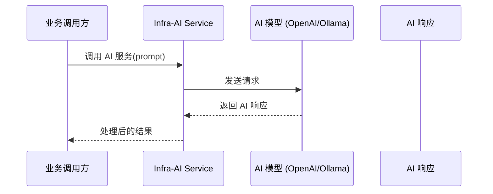

# 功能模块梳理 - Infra-AI AI 集成模块

> 该模块当前仅完成了 Maven 依赖声明和父 POM 集成，尚未编写业务代码，属于框架预留能力。

## 1. 模块功能描述

`infra-ai` 模块封装 AI 能力基础设施，基于 Spring AI 框架集成大模型调用能力。为上层业务模块（web/api/mng）提供统一的 AI 服务抽象。

## 2. 关键业务规则与约束

| 规则 | 说明 |
|------|------|
| 依赖管理 | 通过 `spring-ai-bom` (1.0.3) 统一管理 Spring AI 依赖版本 |
| 父 POM 继承 | 继承 `infra` 父模块，间接依赖 `common` 模块 |
| 具体模型 Starter | 尚未引入具体 AI 模型 Starter（如 OpenAI、Ollama 等） |

## 3. 核心类和方法说明

当前模块 **无 Java 源代码**，仅有 `pom.xml` 配置。

### 3.1 Maven 配置

**文件：** `infra/infra-ai/pom.xml`

| 依赖 | 版本 | 用途 |
|------|------|------|
| `spring-ai-bom` | 1.0.3 | Spring AI 依赖管理 BOM，使用 `import` scope 引入 |

### 3.2 根 POM 中的版本定义

**文件：** `pom.xml`（根）

```xml
<spring.ai.version>1.0.3</spring.ai.version>
```

在 `dependencyManagement` 中声明：
```xml
<dependency>
    <groupId>org.springframework.ai</groupId>
    <artifactId>spring-ai-bom</artifactId>
    <version>${spring.ai.version}</version>
    <type>pom</type>
    <scope>import</scope>
</dependency>
```

## 4. 核心流程

暂无业务流程。预期引入具体模型 Starter 后，数据流转如下：



## 5. 模块下的所有接口

> 当前无 HTTP 接口暴露。

## 6. 异常与补偿机制

| 异常场景 | 预期处理方式 |
|----------|----------|
| AI 模型服务不可用 | 超时控制 + 降级策略 |
| API Key 未配置 | 启动时校验 + 快速失败 |
| 请求速率限制 | 重试 + 退避策略 |
| 响应异常 | 统一异常处理 + 日志记录 |

## 7. 待建设内容

- [ ] 具体 AI 模型 Starter 引入（如 `spring-ai-openai-spring-boot-starter`、`spring-ai-ollama-spring-boot-starter` 等）
- [ ] AI 模型调用服务封装（ChatClient、EmbeddingClient 等）
- [ ] Prompt 模板管理
- [ ] 向量数据库集成（如需要 RAG 能力）
- [ ] AI 服务配置类（API Key、Base URL、Model 选择等）
- [ ] 异常处理与降级策略
