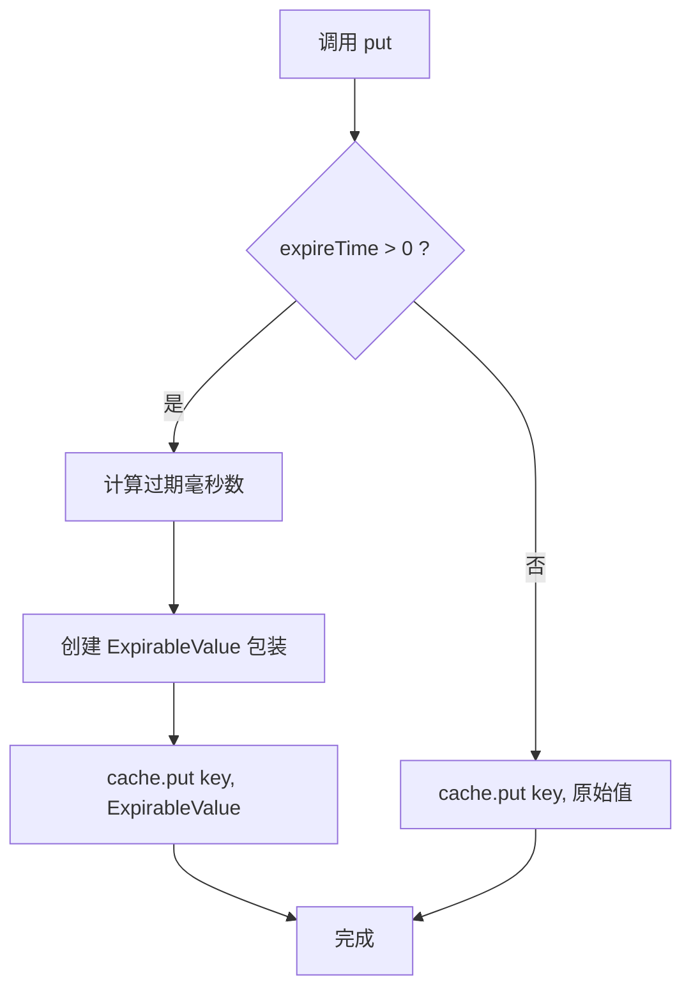
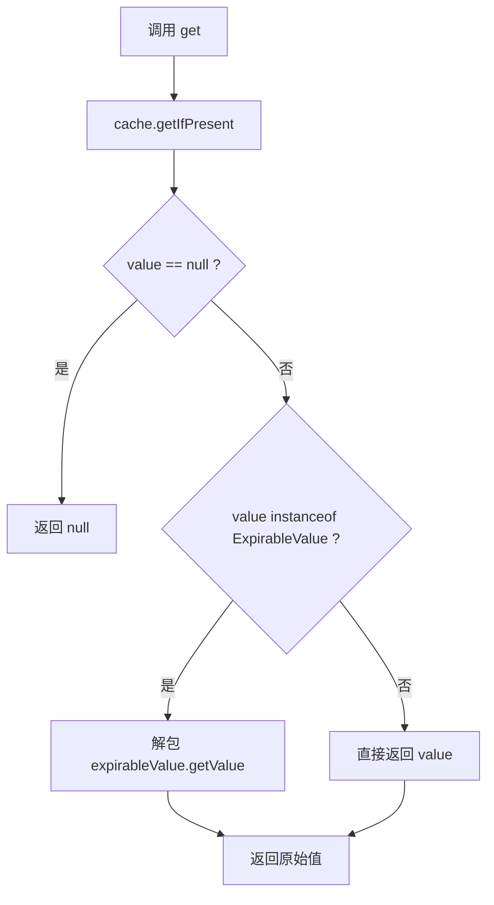
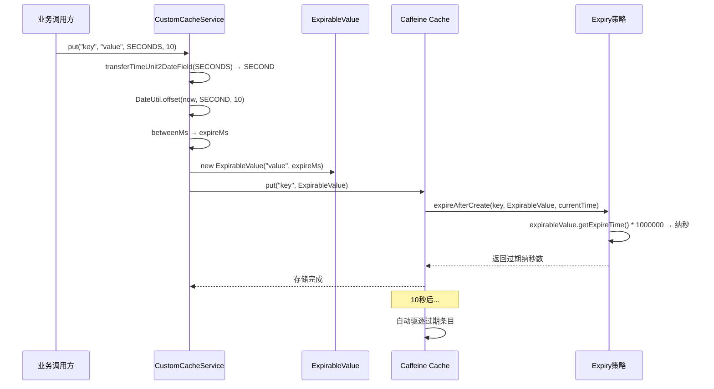

# 功能模块梳理 - Infra-Cache 缓存模块

## 1. 模块功能描述

`infra-cache` 模块封装了本地缓存基础设施，基于 Caffeine 提供高性能的本地缓存能力。模块提供两种缓存使用方式：

- **Spring 注解缓存**：通过 `@Cacheable`、`@CacheEvict` 等注解进行声明式缓存操作
- **编程式自定义缓存**：通过 `CustomCacheService` 提供 API 直接操作缓存，支持动态过期时间

## 2. 关键业务规则与约束

| 规则 | 说明 |
|------|------|
| 注解缓存过期策略 | 写入后 1 天固定过期 |
| 注解缓存容量 | 初始 100，最大 100,000 条 |
| 自定义缓存容量 | 最大 100 条 |
| 自定义缓存过期策略 | 通过 `ExpirableValue` 包装，支持按条目设置不同过期时间 |
| 默认过期时间 | 如果值不是 `ExpirableValue`，默认过期 1 天 |
| 缓存管理器优先级 | `caffeineCacheManager` 为 `@Primary`，Spring 注解缓存默认使用它 |

## 3. 核心类和方法说明

### 3.1 CaffeineCacheConfig - 缓存配置类

**文件：** `infra/infra-cache/src/main/java/com/eking/infra/cache/CaffeineCacheConfig.java`

| Bean | 类型 | 说明 |
|------|------|------|
| `caffeineCacheManager` | `CacheManager` | @Primary，Spring Cache 注解使用的默认缓存管理器 |
| `customCache` | `Cache<Object, Object>` | 自定义 Caffeine Cache 实例，支持动态过期 |

**customCache 的过期策略实现：**

使用 Caffeine 的 `Expiry` 接口自定义过期逻辑：
- `expireAfterCreate`：如果值是 `ExpirableValue`，使用其 `expireTime`（毫秒转纳秒），否则默认 1 天
- `expireAfterUpdate`：保持当前剩余时间不变
- `expireAfterRead`：保持当前剩余时间不变

### 3.2 CustomCacheService - 自定义缓存服务

**文件：** `infra/infra-cache/src/main/java/com/eking/infra/cache/CustomCacheService.java`

| 方法 | 签名 | 说明 |
|------|------|------|
| `put` | `put(String key, T value)` | 存入缓存，使用默认过期时间 |
| `put` | `put(String key, T value, TimeUnit, int expireTime)` | 存入缓存，指定过期时间 |
| `get` | `T get(String key)` | 获取缓存值，自动解包 `ExpirableValue` |
| `remove` | `remove(String key)` | 删除单个缓存条目 |
| `remove` | `remove(List<String> keys)` | 批量删除缓存条目 |
| `clear` | `clear()` | 清空整个缓存 |

**put(key, value, TimeUnit, expireTime) 方法流程：**

**get(key) 方法流程：**

**transferTimeUnit2DateField 私有方法：**

| TimeUnit | DateField |
|----------|-----------|
| `SECONDS` | `DateField.SECOND` |
| `MINUTES` | `DateField.MINUTE` |
| `HOURS` | `DateField.HOUR` |
| `DAYS` | `DateField.DAY_OF_MONTH` |
| `MILLISECONDS` | `DateField.MILLISECOND` |
| 其他 | `DateField.SECOND`（默认） |

### 3.3 ExpirableValue\<V\> - 可过期值包装类

**文件：** `infra/infra-cache/src/main/java/com/eking/infra/cache/ExpirableValue.java`

| 字段 | 类型 | 说明 |
|------|------|------|
| `value` | `V` | 被包装的实际缓存值 |
| `expireTime` | `long` | 过期时间（单位：毫秒） |

该类作为 `CustomCacheService` 和 `CaffeineCacheConfig` 之间的桥梁，将过期时间信息随值一起存入 Caffeine，在 `Expiry.expireAfterCreate` 中读取并设置对应的过期纳秒数。

## 4. 核心流程

### 缓存写入与过期流程

## 5. 模块下的所有接口梳理

> `infra-cache` 模块为基础设施库，不直接暴露 HTTP 接口。通过 `CustomCacheService` 提供 Java API 供其他模块调用。

## 6. 异常与补偿机制

| 异常场景 | 处理方式 |
|----------|----------|
| 缓存 key 不存在 | `get()` 返回 `null` |
| 缓存已过期 | Caffeine 自动驱逐，`get()` 返回 `null` |
| 并发写入同一 key | Caffeine 内部保证线程安全 |
| 缓存容量超限 | Caffeine 根据 LRU/LFU 策略自动淘汰 |
