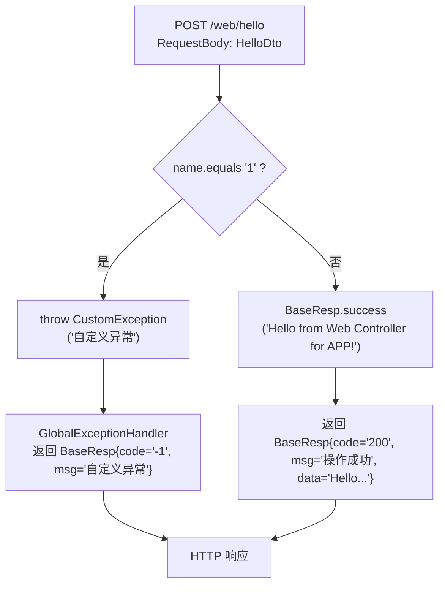

# 功能模块梳理 - Web 服务模块

## 1. 模块功能描述

`web` 模块是面向前端/APP 客户端的主服务模块，作为可独立部署的 Spring Boot 应用，提供 HTTP REST API 接口。当前包含：

- Spring Boot 应用启动入口
- 测试 Controller 接口
- 完整的异常处理和响应封装演示

**启动类：** `com.eking.web.WebApplication`
**服务端口：** 8080
**组件扫描范围：** `com.eking`（覆盖所有模块的组件）

## 2. 关键业务规则与约束

| 规则 | 说明 |
|------|------|
| 组件扫描 | `scanBasePackages = "com.eking"`，确保加载 common 和 infra 中的 Bean |
| 日期格式 | 统一使用 `yyyy-MM-dd HH:mm:ss`，时区 `GMT+8` |
| 路径匹配 | 使用 `ant_path_matcher` 策略 |
| Bean 覆盖 | 允许 Bean 定义覆盖 (`allow-bean-definition-overriding: true`) |
| 文件上传 | 最大文件 100MB，最大请求 100MB |
| 环境配置 | 默认激活 `test` 环境 Profile |

## 3. 核心类和方法说明

### 3.1 WebApplication - 应用启动类

**文件：** `web/src/main/java/com.eking.web/WebApplication.java`

```java
@SpringBootApplication(scanBasePackages = "com.eking")
public class WebApplication {
    public static void main(String[] args) {
        SpringApplication.run(WebApplication.class, args);
    }
}
```

### 3.2 TestWebController - 测试接口控制器

**文件：** `web/src/main/java/com/eking/web/controller/TestWebController.java`

| 注解 | 值 |
|------|------|
| `@RestController` | REST 控制器 |
| `@RequestMapping` | `/web` |
| `@Tag` | name="Web开放测试接口", description="Web开放测试接口描述" |

## 4. 核心流程

### hello 接口处理流程



## 5. 模块下的所有接口梳理

### 5.1 POST /web/hello - Hello 测试接口

| 属性 | 值 |
|------|------|
| **URL** | `POST /web/hello` |
| **Swagger** | `@Operation(summary="hello测试接口", description="hello测试接口描述")` |
| **请求格式** | `application/json` |

**请求参数：**

| 参数名 | 类型 | 必填 | 说明 |
|--------|------|------|------|
| `name` | `String` | 是 | 名字 |

**请求示例：**

```json
{
    "name": "张三"
}
```

**返回值：**

| 字段 | 类型 | 说明 |
|------|------|------|
| `code` | `String` | 状态码 |
| `msg` | `String` | 响应消息 |
| `data` | `String` | 响应数据 |

**成功响应示例：**

```json
{
    "code": "200",
    "msg": "操作成功",
    "data": "Hello from Web Controller for APP!"
}
```

**异常响应示例（name="1"时）：**

```json
{
    "code": "-1",
    "msg": "自定义异常",
    "data": null
}
```

**接口代码流程：**

1. 接收 `HelloDto` 请求体（自动 JSON 反序列化）
2. 判断 `name` 是否等于 `"1"`
3. 如果等于 `"1"`，抛出 `CustomException("自定义异常")`，由 `GlobalExceptionHandler` 捕获处理
4. 否则返回 `BaseResp.success("Hello from Web Controller for APP!")`

**异常处理：**

| 异常场景 | 异常类型 | 处理方式 |
|----------|----------|----------|
| name = "1" | `CustomException` | 返回 `{code:"-1", msg:"自定义异常"}` |
| 请求体缺失 | `HttpMessageNotReadableException` | 由 Spring 框架处理 |
| name 为 null | `NullPointerException` | 由 `GlobalExceptionHandler.handlerException` 兜底 + 企微告警 |

## 6. 异常与补偿机制

| 异常场景 | 处理机制 | 补偿措施 |
|----------|----------|----------|
| 请求参数校验失败 | `GlobalExceptionHandler` 处理 `MethodArgumentNotValidException` | 返回具体校验错误信息 |
| 业务逻辑异常 | `GlobalExceptionHandler` 处理 `CustomException` | 返回自定义错误码 |
| 未预期系统异常 | `GlobalExceptionHandler` 处理 `Exception` | 记录日志 + 企微告警 |

## 7. 测试用例

### CaffeineCacheTest - 缓存服务集成测试

**文件：** `web/src/test/java/CaffeineCacheTest.java`

| 测试方法 | 说明 |
|----------|------|
| `testExpireTime()` | 测试带过期时间的缓存，验证10秒后缓存自动过期 |
| `testGet()` | 测试基本的缓存写入和读取（List类型值） |
| `testRemove()` | 测试缓存删除功能 |
